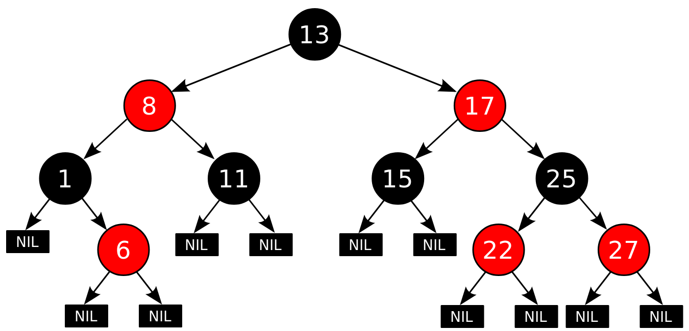

# Red Black Tree

| Algorithm | Average | Worst case |
| --- | --- | --- |
| Space | O(n) | O(n) |
| Search | O(log n) | O(log n) |
| Insert | O(log n) | O(log n) |
| Delete | O(log n) | O(log n) |

2-3-4 트리는 4-노드를 무조건 분리하기 때문에 채워지지 않는 기억장소가 많을 수 있다.

효율적인 기억장소 사용을 위해서 2-3-4 트리를 이진 트리로 나타낸 것을 레드 블랙 트리라고 한다.
레드 블랙 트리에서 적색 노드를 부모 노드와 묶어서 하나의 노드로 표현하면 2-3-4 트리가 된다.

레드 블랙 트리는 각 노드에 색깔을 저장하는 공간을 추가하여 균형유지에 사용한다

## 규칙



- 모든 노드는 Red이거나 Black이다
- 루트 노드는 Black이다
- 자식이 없는경우 NULL 노드를 자식으로 가지며 모든 NULL 노드는 Black이다
- 노드가 Red이면 그 노드의 자식은 모두 Black이다
- 각 노드로부터 노드의 자손인 leaf로 가는 경로들은 모두 같은 수의 Black 노드를 포함한다

각 노드는 leaf 노드로부터 해당노드에 이르는 가장 긴 경로인 높이(h)와 경로상의 검은노드수(bh)를 갖고있다

## 삽입

기본적으로 삽입연산은 이진 탐색 트리와 동일하다.
다만 삽입 후 레드 블랙트리의 속성을 유지하기 위한 추가 연산이 필요하다.

```text
        g
      /   \
     p     u
    / \   / \
   x  T3 T4 T5
  / \
nil nil
```

삽입할 요소 `x`는 Red(Leaf 노드가 Black이므로)

- x == Root로 삽입하는 경우: x -> Black

- parent == Black: 삽입

- parent == Red (g == Black)

  - uncle(부모노드의 sibling) == Red
    - p와 u를 Black으로 변경
    - g를 Red로 변경
    - g에 대해서 **재배열 연산**을 재귀적으로 적용한다(g는 삽입 직후 x의 상태와 같다)

  - uncle(부모노드의 sibling) == Black (nil인 경우도 Black임)
    - p와 g의 색을 반전(p = Black, g = Red)
    - p가 g의 왼쪽 자식이고, x가 p의 왼쪽 자식인 경우: Left-Left Case
      - RightRotate(g)
    - p가 g의 왼쪽 자식이고, x가 p의 오른쪽 자식인 경우: Left-Right Case
      - LeftRotate(p)
      - RightRotate(g)
    - p가 g의 오른쪽 자식이고, x가 p의 오른쪽 자식인 경우: Right-Right Case
      - LeftRotate(g)
    - p가 g의 오른쪽 자식이고, x가 p의 왼쪽 자식인 경우: Right-Left Case
      - RightRotate(g)
      - LeftRotate(p)

## 삭제
